# Edu-AI Classroom: Business Workflow

## Overview

This document outlines the core business workflows for the Edu-AI Classroom platform, including user journeys, payment touchpoints, and system interactions.

---

## 1. Teacher Onboarding & Class Setup


---

## 2. Smart Exam Generation Flow (Core Revenue Driver)

```mermaid
flowchart TD
    Start([Teacher: Need to Create Exam]) --> SelectClass[Select Class & Subject]
    SelectClass --> BrowseTextbook[Browse Textbook Library]
    BrowseTextbook --> CheckAccess{Has Access to Grade?}

    CheckAccess -->|Free Tier: Grade 1-3| DefineMatrix[Define Exam Matrix]
    CheckAccess -->|Locked: Grade 4-5| PaywallContent[🔒 Upgrade to Pro for Full Library]
    PaywallContent --> UpgradeContent{Upgrade?}
    UpgradeContent -->|Yes| ProcessPayment[Process Payment]
    UpgradeContent -->|No| End1([Exit])
    ProcessPayment --> DefineMatrix

    DefineMatrix --> SetDifficulty[Set Easy/Medium/Hard Distribution]
    SetDifficulty --> SelectChapters[Select Chapters to Cover]
    SelectChapters --> ChooseQuestionTypes[Choose Question Types: MCQ/Essay]
    ChooseQuestionTypes --> CheckQuota{Exams Generated This Month}

    CheckQuota -->|< 3 exams: Free| AIGeneration[🤖 AI Auto-Generates Exam]
    CheckQuota -->|≥ 3 exams| PaywallExam[🔒 Upgrade for Unlimited Exams]

    PaywallExam --> UpgradeExam{Upgrade to Pro?}
    UpgradeExam -->|Yes| ProcessPayment2[Process Payment 299k VND/mo]
    UpgradeExam -->|No| End2([Exit])
    ProcessPayment2 --> AIGeneration

    AIGeneration --> ReviewQuestions[Review Generated Questions]
    ReviewQuestions --> CheckQuality{Satisfied with Questions?}

    CheckQuality -->|No| SwapQuestions[Manually Swap Questions]
    SwapQuestions --> ReviewQuestions
    CheckQuality -->|Yes| FinalizeExam[Finalize Exam]

    FinalizeExam --> ExportFormat{Export Format}
    ExportFormat -->|Free: PDF| ExportPDF[Export to PDF - Basic Template]
    ExportFormat -->|Pro: Docx| CheckProStatus{Has Pro Plan?}

    CheckProStatus -->|Yes| ExportDocx[Export to Docx - Editable]
    CheckProStatus -->|No| PaywallExport[🔒 Upgrade for Advanced Formats]
    PaywallExport --> End3([Exit])

    ExportPDF --> S3Upload[Upload to S3: /generated-exams/]
    ExportDocx --> S3Upload
    S3Upload --> PresignedURL[Generate Presigned URL - 15min]
    PresignedURL --> Download[Download Exam]
    Download --> PrintExam[Print for Classroom Use]
    PrintExam --> End4([Complete])

    style AIGeneration fill:#e1f5ff
    style PaywallExam fill:#ffe1e1
    style PaywallContent fill:#ffe1e1
    style PaywallExport fill:#ffe1e1
    style ProcessPayment fill:#e8f5e9
    style ProcessPayment2 fill:#e8f5e9
    style ExportDocx fill:#fff4e1
```



---

## 3. Student AI Tutor Interaction Flow

```mermaid
flowchart TD
    Start([Student: Needs Homework Help]) --> Login[Student Login]
    Login --> ViewClasses[View Enrolled Classes]
    ViewClasses --> SelectClass[Select Class]
    SelectClass --> OpenTutor[Open AI Tutor Interface]

    OpenTutor --> CheckQuota{AI Queries This Month}
    CheckQuota -->|< 50 queries| AskQuestion[Ask Question in Natural Language]
    CheckQuota -->|≥ 50 queries| PaywallTutor[🔒 Query Limit Reached]

    PaywallTutor --> TeacherUpgrade[Notify: Ask Teacher to Upgrade]
    TeacherUpgrade --> End1([Exit])

    AskQuestion --> AIProcessing[🤖 AI Processing with RAG]
    AIProcessing --> ContextRetrieval[Retrieve Relevant Textbook Content]
    ContextRetrieval --> GenerateHints[Generate Socratic Hints]

    GenerateHints --> ShowResponse[Display Response:<br/>- Guiding Questions<br/>- Textbook References<br/>- No Direct Answers]
    ShowResponse --> StudentUnderstand{Understand?}

    StudentUnderstand -->|No| FollowUp[Ask Follow-up Question]
    FollowUp --> AIProcessing

    StudentUnderstand -->|Yes| SaveHistory[Save Conversation History]
    SaveHistory --> TeacherReview[Available for Teacher Review]
    TeacherReview --> End2([Learning Complete])

    style AIProcessing fill:#e1f5ff
    style PaywallTutor fill:#ffe1e1
    style ShowResponse fill:#e8f5e9
```



---

## 4. Payment & Subscription Flow

```mermaid
flowchart TD
    Start([User Hits Paywall]) --> ShowModal[Show Upgrade Modal]
    ShowModal --> ViewPricing[Display Pricing:<br/>Teacher Pro: 299k VND/mo<br/>School License: Custom]

    ViewPricing --> SelectPlan{Select Plan}
    SelectPlan -->|Monthly| MonthlyPlan[299,000 VND/month]
    SelectPlan -->|Yearly - 20% off| YearlyPlan[2,870,400 VND/year]
    SelectPlan -->|School License| ContactSales[Contact Sales Team]

    MonthlyPlan --> PaymentMethod{Payment Method}
    YearlyPlan --> PaymentMethod

    PaymentMethod -->|VNPay| VNPay[VNPay Gateway - Vietnam]
    PaymentMethod -->|Bank Transfer| BankTransfer[Local Bank Transfer]
    PaymentMethod -->|Credit Card| Stripe[Stripe - International]

    VNPay --> ProcessPayment[Process Payment]
    BankTransfer --> ProcessPayment
    Stripe --> ProcessPayment

    ProcessPayment --> PaymentStatus{Payment Success?}
    PaymentStatus -->|Failed| Retry[Show Error + Retry Option]
    Retry --> PaymentMethod

    PaymentStatus -->|Success| UpdateDB[Update User Subscription in DB]
    UpdateDB --> EmitEvent[Emit: SubscriptionActivated Event]
    EmitEvent --> UpdateJWT[Update JWT with Tier Info]
    UpdateJWT --> UnlockFeatures[Unlock Premium Features:<br/>✅ Unlimited Exams<br/>✅ Full Textbook Library<br/>✅ Unlimited AI Queries<br/>✅ Advanced Exports]

    UnlockFeatures --> SendReceipt[Send Receipt Email]
    SendReceipt --> RedirectDashboard[Redirect to Dashboard]
    RedirectDashboard --> ShowSuccess[Show Success Message]
    ShowSuccess --> End([Complete])

    ContactSales --> SalesTeam[Sales Team Follow-up]
    SalesTeam --> CustomQuote[Provide Custom Quote]
    CustomQuote --> End2([Enterprise Flow])

    style ProcessPayment fill:#fff4e1
    style UnlockFeatures fill:#e8f5e9
    style ShowSuccess fill:#e8f5e9
```



---

## 5. Content Management & Asset Upload Flow

```mermaid
flowchart TD
    Start([Teacher: Need Supplementary Materials]) --> Dashboard[Access Dashboard]
    Dashboard --> ContentLibrary[Go to Content Library]
    ContentLibrary --> BrowseOrUpload{Action}

    BrowseOrUpload -->|Browse| FilterContent[Filter by Grade/Subject/Chapter]
    BrowseOrUpload -->|Upload| UploadAsset[Upload Asset: PDF/Image/Video]

    FilterContent --> ViewContent[View Textbook Pages & Resources]
    ViewContent --> UseInLesson[Use in Lesson Plan/Exam]

    UploadAsset --> ValidateFile{File Valid?}
    ValidateFile -->|No| ShowError[Show Error: Size/Format]
    ShowError --> UploadAsset

    ValidateFile -->|Yes| S3Upload[Upload to S3: /user-uploads/{userId}/]
    S3Upload --> GenerateMetadata[Generate Metadata & Tags]
    GenerateMetadata --> SaveToDB[Save Reference in Content DB]
    SaveToDB --> ShareOption{Share with Other Teachers?}

    ShareOption -->|Yes| CheckPro{Has Pro Plan?}
    CheckPro -->|No| PaywallShare[🔒 Sharing Requires Pro]
    CheckPro -->|Yes| AddToShared[Add to Shared Library]

    ShareOption -->|No| PrivateLibrary[Keep in Private Library]
    AddToShared --> Success[Upload Complete]
    PrivateLibrary --> Success
    PaywallShare --> End1([Exit])

    Success --> UseInLesson
    UseInLesson --> End2([Complete])

    style S3Upload fill:#fff4e1
    style PaywallShare fill:#ffe1e1
    style Success fill:#e8f5e9
```

---

## 6. Student Enrollment Flow


---

## 7. Analytics & Teacher Insights Flow


---

## 8. Question Bank Management Flow (Pro Feature)


---

## Key Business Rules & Payment Touchpoints

### 🎯 **Monetization Points**

| Flow                | Free Tier Limit          | Paywall Trigger           | Action Required             |
| ------------------- | ------------------------ | ------------------------- | --------------------------- |
| **Exam Generation** | 3 exams/month            | 4th exam                  | Upgrade to Pro: 299k VND/mo |
| **AI Tutor**        | 50 queries/month/student | 51st query                | Teacher upgrades class      |
| **Textbook Access** | Grade 1-3 only           | Grade 4-5 content         | Upgrade to Pro              |
| **Class Limit**     | 1 Class, 30 Students     | 2nd Class or 31st Student | Upgrade to Pro              |
| **Export Formats**  | Basic PDF only           | Docx/Custom templates     | Pro feature                 |
| **Question Bank**   | View only                | Create/Edit/Import        | Pro feature                 |
| **Analytics**       | Basic metrics            | Advanced insights         | Pro feature                 |
| **Asset Sharing**   | Private only             | Share with colleagues     | Pro feature                 |

### 💡 **Conversion Strategy**

1. **Hook Phase (Free Trial):** 7-day full Pro access
2. **Habit Building:** Free tier allows core functionality
3. **Value Realization:** Teachers generate 2-3 exams (feel the value)
4. **Natural Paywall:** Hits limit during busy exam season
5. **Easy Upgrade:** One-click payment via VNPay (local) or Stripe

### 📊 **Success Metrics**

- **Free → Pro Conversion Rate Target:** 15-20%
- **Average Time to Conversion:** 14-21 days
- **Retention Rate:** 85% (annual)
- **Expansion Revenue:** School licenses from individual users

---

## System Architecture Context

These workflows interact with the following microservices:

- **User Service:** Authentication, profile management, subscription status
- **Content Service:** Textbook library, asset management
- **Assessment Service:** Exam generation, question bank
- **AI Service:** Tutor interactions, RAG processing
- **Payment Service:** Subscription management, payment processing
- **Analytics Service:** Usage tracking, insights generation

Each service communicates via HTTP/gRPC and shares correlation IDs for distributed tracing.
