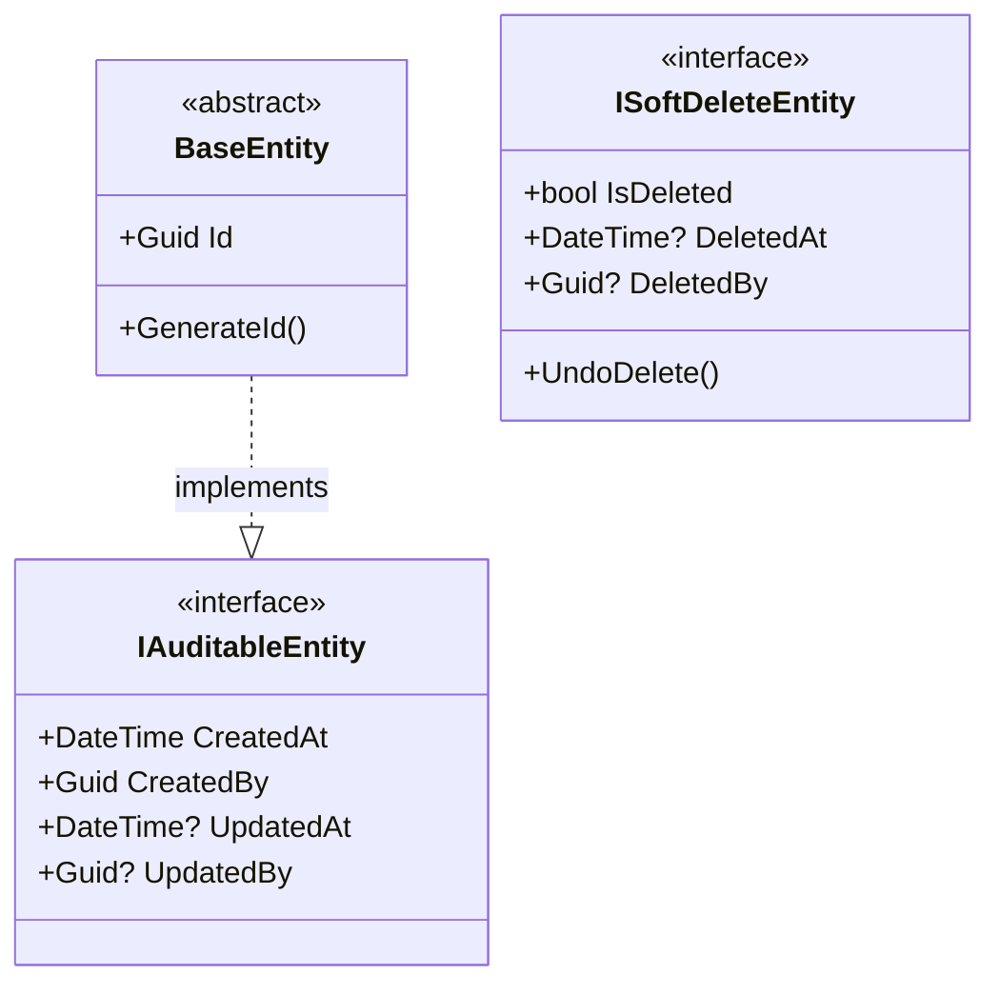
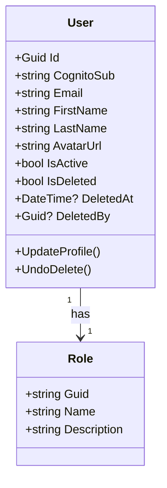
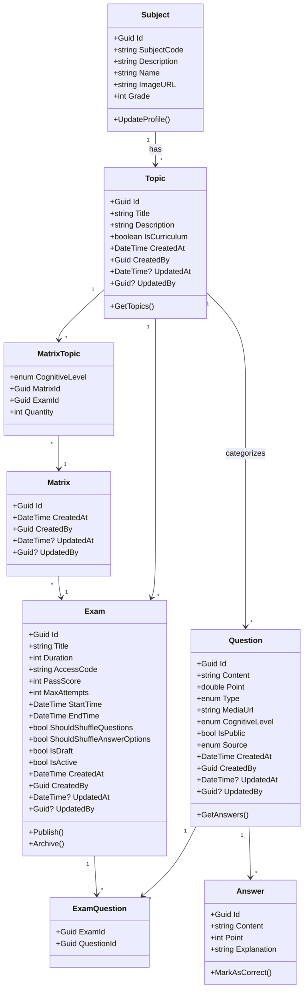
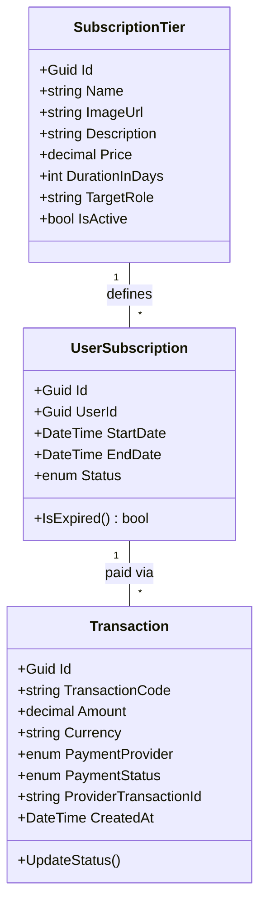
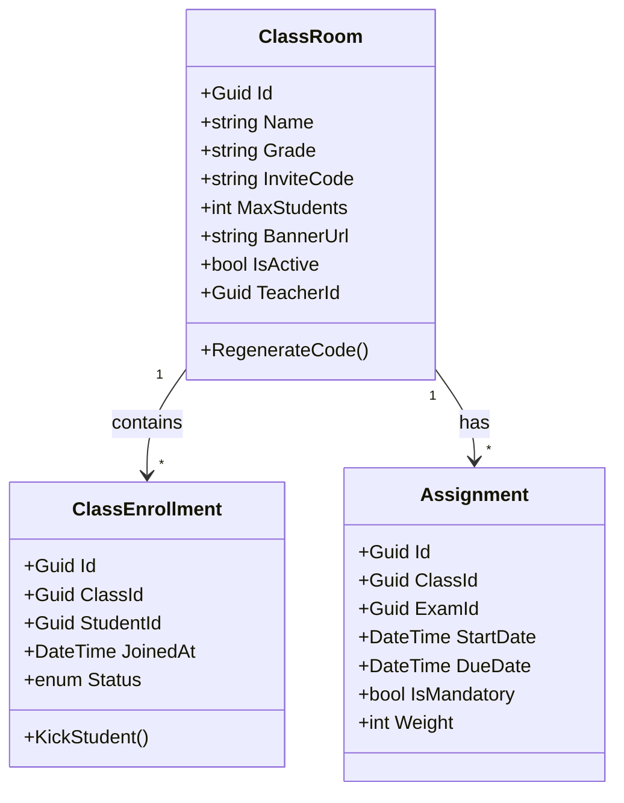

# Microservices Details

Count: 5

## Shared between services

## Microservices

### I. User Service

#### Responsibility

Roles:

- Admin: Can do everything, bypass all restrictions in the application
- Teacher: Able to do everything that allow role Teacher to do, usually teaching and exam related stuffs
- Student: Basic exam taking and practicing. anything that the role Student can do

Authentication:

- Intergrated with Cognito to enable Auth and sign-in, sign-ups, account related stuffs.

User Static-file:

- Intergated with S3 compatible SDK to sign-url all the assets that users upload, such as avatars, personal picture or question set thumbnail... etc

#### Class Diagram

---

### II. Exam Service

#### Responsibility

Primary Goal: Manage the creation and structure of educational content.
Curriculum Management: CRUD for Subjects and Topics. (Initially seeded manually to follow the Vietnamese curriculum).
Question Bank: Manual CRUD for Questions and Answers. Includes metadata tagging (Cognitive Level, Difficulty, Topic).
Exam Orchestration: Building the Exam entity by linking multiple questions.
Matrix Engine: Creating the "Blueprint" (The Matrix) that defines how many questions per topic/difficulty an exam should have.
Export Engine: Converting the structured Exam data into PDF format for printing or offline use.

#### Class Diagram

---

### III. Subscription Service

#### Responsibility

Primary Goal: Manage monetization and feature-gate access based on payment status.
Plan Management: Defining SubscriptionTiers (Free vs. Pro) and their specific constraints (e.g., "Max 30 students").
Payment Integration: Communicating with VNPay, Stripe, or PayOS to process transactions.
Entitlement Checking: Providing a "Gatekeeper" API that other services call to see if a user is allowed to perform an action (e.g., CanUserCreateMoreExams?).
Transaction Logging: Maintaining a permanent ledger of all payments and renewal dates for accounting.

#### Class Diagram

### IV. AI Service

#### Responsibility

Primary Goal: Augment the manual workflow with generative capabilities via Gemini + MCP.
Contextual Generation: Taking a Matrix (from Exam Svc) and generating Questions/Answers that fit the specific Vietnamese curriculum via the MCP tool.
Validation: Ensuring generated content matches the requested CognitiveLevel (Easy/Medium/Hard).
Student Tutoring: Providing a chat-based interface for students to ask questions about specific topics (using "Teacher-like" persona).
Usage Budgeting: Tracking token consumption per user to ensure the platform remains profitable (preventing AI spam).
Formatting: Ensuring AI output is always converted into the exact JSON structure the Exam Service expects.
Exam question and answers generation

- Take in an exam matrix, grade, subject and topic -> Query to Gemini AI that have our MCP connected for metadata of each topic in that subject of that grade and generates the questions + answers following that matrix with proper grade and following a json -> api
- Can generate just one question + answers

- Can support query tutoring and guiding students on how to do a specific math, speaking to a student of that grade

#### Requirements

- `Role:Teacher` and `Role:Student` need to have a subscription
- Normal users have no access

### Class Service

#### Responsibility

Primary Goal: Connect Users (Teachers/Students) to Content (Exams) in a structured environment.
Classroom Management: CRUD for ClassRoom entities (Name, Grade, Year).
Membership Logic: Handling the 6-digit Invite Code system for student enrollment.
Assignment Logic: The "Bridge" – linking an ExamId to a ClassId with a specific DueDate.
Attendance/Roster: Maintaining the list of active students within a specific teacher's classroom.
Progress Tracking: (Manual Phase) Storing simple records of which students have completed which assignments.

#### Class Diagram

