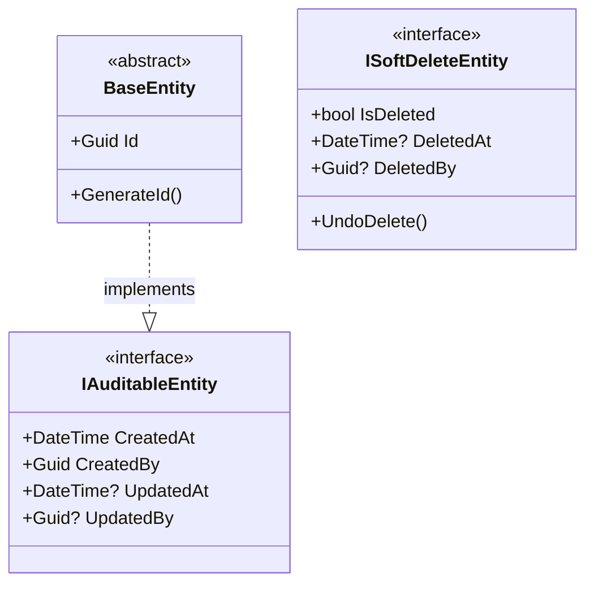
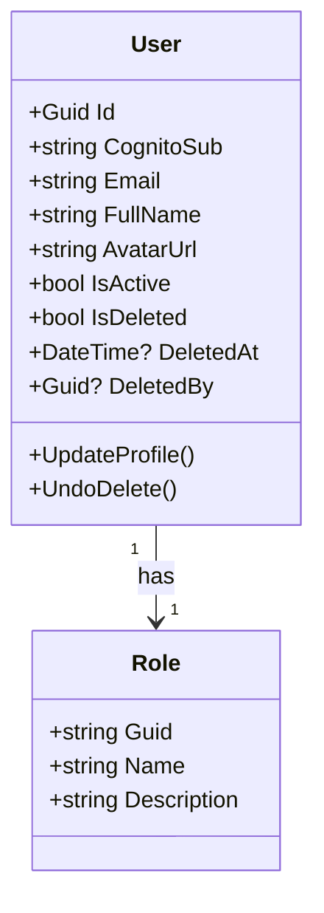
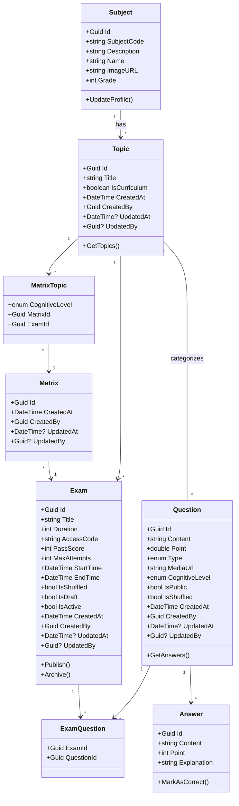

# Microservices Details

Count: 5

## Shared between services

## Microservices

### I. User Service

#### Responsibility

Roles:

- Admin: Can do everything, bypass all restrictions in the application
- Teacher: Able to do everything that allow role Teacher to do, usually teaching and exam related stuffs
- Student: Basic exam taking and practicing. anything that the role Student can do

Authentication:

- Intergrated with Cognito to enable Auth and sign-in, sign-ups, account related stuffs.

User Static-file:

- Intergated with S3 compatible SDK to sign-url all the assets that users upload, such as avatars, personal picture or question set thumbnail... etc

#### Class Diagram

---

### II. Exam Service

#### Responsibility

Exams

- Allow `Role:Teacher` to create, save and export exams.
- Allow `Role:Teacher` to create, save and export questions of an exam.
- Allow `Role:Teacher` to create, save and export answers of questions of exams.

Exam Matrix

- Allow `Role:Teacher` to create exam matrix, topic.

Subject _ex: Toán_

- Handles seeded Subject Data like Math Grade 1, Math Grade 2...

Curriculum Topic _ex: Toán lớp 1 chương 1, chương 2, ..._

- Allow `Role:Teacher` to create, save custom topics.

#### Class Diagram

---

## III. Subscription Service

### Responsibility

Payment and Transactions

- Handle Payment flow and saves all transactions for analysis
- Subsciption Tier and tracks what each user haves

### Requirements

- `Role:Student` and `Role:Teacher` have different subscription tier

- Integrate with PayOS, Momo or PayVN

### IV. AI Service

#### Responsibility

Exam question and answers generation

- Take in an exam matrix, grade, subject and topic -> Query to Gemini AI that have our MCP connected for metadata of each topic in that subject of that grade and generates the questions + answers following that matrix with proper grade and following a json -> api

- Can generate just one question + answers

- Can support query tutoring and guiding students on how to do a specific math, speaking to a student of that grade

#### Requirements

- `Role:Teacher` and `Role:Student` need to have a subscription
- Normal users have no access

### Class Service

#### Responsibility

// To do
